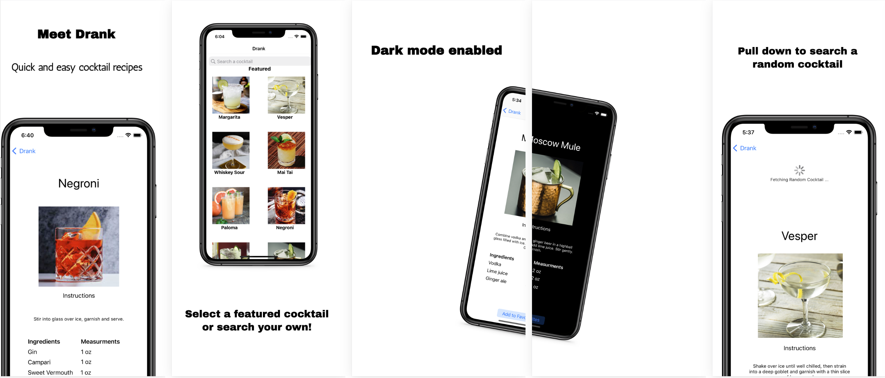

#  Drank
quick and easy cocktail recipes

## Features
- 10 preset, featured cocktails 
- searchbar to search any cocktail your heart desires
- Once you've found a cocktail you really enjoy, you can add it to your favorites!

## Upcoming Features and Bug Fixes
- word wrapping issue with ingredients with longer titles
- issue with the collection view's contraints causing cells to not allign properly

- plan add the ability to rearrange your favorites list
- plan to add Unsplash API functionaility to pull down images of searched cocktails to fill the recipe views

## Core Tools and Components

* Core Data implimentation
* Collection Views
* Swift closures and completion handlers.
* Parse JSON with the native Encodable and Decodable protocols. 

>This is a companion project to The App Brewery's Complete App Development Bootcamp [www.appbrewery.co](https://www.appbrewery.co/)

